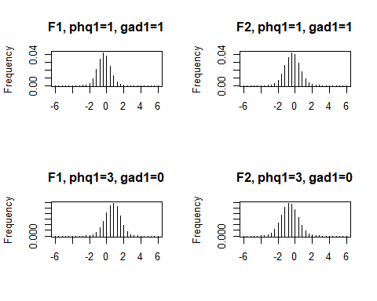
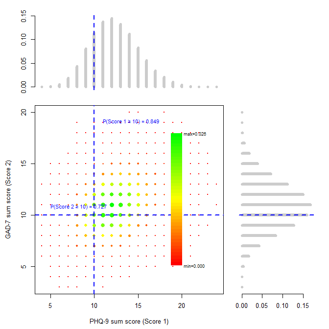

<!-- README.md is generated from README.Rmd. Please edit that file -->

# dedaptive

<!-- badges: start -->

<!-- badges: end -->

`dedaptive` provides tools for **DEcision-oriented aDAPTIVE testing**
based on  
**multidimensional item response theory (IRT)**. The framework is
described in Wyss et al. (2025). For the installation you need the
package `remotes` (which has to be installed in adavance). You can
install the development version of dedaptive with
`remotes::install_github("Statric/dedaptive")`

This workflow demonstrates:

1.  Loading the data set integrated in the package and preparing
    training and prediction data sets  
2.  Fitting a multidimensional IRT model (`fitIrt`)
3.  Simulation-based predictions of joint item distributions
    (`predJointDistRespIrt`
4.  Performing probabilistic predictions with fixed-item panels
    (`fixSelectionIrt`)
5.  Performing adaptive, cost-sensitive testing (`dedaptiveIrt`)

# 1. Load and prepare the example data

We load the `dedaptive` library and then the included data set
`screenMental`

``` r
library(dedaptive)
#> Lade nötiges Paket: mirt
#> Lade nötiges Paket: stats4
#> Lade nötiges Paket: lattice
data(screenMental)
head(screenMental, 10)
#>    id sex age phq1 phq2 phq3 phq4 phq5 phq6 phq7 phq8 phq9 gad1 gad2 gad3 gad4
#> 1   1   0  34    0    1    1    1    2    2    0    0    0    2    1    1    1
#> 2   2   1  55    0    1    1    1    1    1    0    0    0    2    1    1    1
#> 3   3   1  23    1    0    1    1    1    1    1    1    1    1    2    1    1
#> 4   4   0  49    1    2    3    1    0    2    1    1    1    1    1    2    1
#> 5   5   1  26    1    1    0    1    1    2    2    0    0    0    0    1    0
#> 6   6   1  25    3    1    1    1    1    3    1    3    0    2    2    2    3
#> 7   7   1  55    3    3    3    3    2    3    3    3    1    3    3    3    3
#> 8   8   1  29    1    0    0    1    1    0    1    0    0    3    0    0    2
#> 9   9   1  43    1    1    1    2    0    1    1    0    0    2    2    2    1
#> 10 10   1  28    1    0    1    0    0    3    0    0    1    1    1    2    3
#>    gad5 gad6 gad7
#> 1     0    1    1
#> 2     0    2    1
#> 3     2    1    0
#> 4     1    1    0
#> 5     0    1    0
#> 6     0    1    0
#> 7     2    1    3
#> 8     0    1    0
#> 9     1    1    1
#> 10    1    2    1
```

The data set `screenMental`is a simulated data set based on statistical
methods applied to the data set with item responses of real individuals
that was used in the publication of Wyss et al. (2025) (introducing the
dedaptive testing framework). For the data simulation the functions
`fitIrt` and `predJointDistRespIrt` were used, more information can be
accessed with `?screenMental`. The data set contains the sex and age as
well as 16 responses of the nine items of the Patient Health
Questionnaire 0 (PHQ-9) and the seven items of the Generalized Anxiety
Disorder-7 (GAD-7) scale.

In the following (chapter 4 and 5) we are interested in predicting the
distribution of the PHQ-9 and GAD-7 sum scores as well as the decisions
PHQ-9 sum score $\geq$ 10 and GAD-7 sum score $\geq$ 10 (moderate to
severe symptoms). We define the functions to compute the sum scores
(assuming the first nine items are the one from PHQ and item 10 to 16
the one form GAD) and the thresholds for the decisions:

``` r
# Extract PHQ-9 and GAD-7 items
itemsPhq<- colnames(screenMental)[grepl("phq", colnames(screenMental))]
itemsGad<- colnames(screenMental)[grepl("gad", colnames(screenMental))]
itemsAll<- c(itemsPhq, itemsGad)

# Score functions
funSumScores <- list(
  function(x) sum(x[1:9]),   # PHQ-9 sum
  function(x) sum(x[10:16])    # GAD-7 sum
)

# Thresholds
thresModSev <- c(10, 10)

# Add scores and decisions to the data set
screenMental$phq_score<- apply(screenMental[, itemsAll], 1, funSumScores[[1]])
screenMental$gad_score<- apply(screenMental[, itemsAll], 1, funSumScores[[2]])

screenMental$phq_dec<- ifelse(screenMental$phq_score>=thresModSev[1], 1, 0)
screenMental$gad_dec<- ifelse(screenMental$gad_score>=thresModSev[2], 1, 0)
```

In the IRT models we use the sex and the age as predictors for the item
responses (respectively the assumed underlying latent variables). We did
use standardized age values as predictors, i.e. (subtract the mean and
divide by the standard deviation):

``` r
screenMental$ageStand<- (screenMental$age-mean(screenMental$age))/sd(screenMental$age)
```

To illustrate the usage of the function we chose one individual to
perform out-of-sample predictions and all other individuals are used to
train the IRT model. We chose a female, 19 years old person with a PHQ-9
sum score of 11 and a GAD-7 sum score of 9.

``` r
#screenMental[which(screenMental$phq_score==11 & screenMental$gad_score==9), ]
idPred<- 217
screenMental[screenMental$id==idPred, ]
#>      id sex age phq1 phq2 phq3 phq4 phq5 phq6 phq7 phq8 phq9 gad1 gad2 gad3
#> 217 217   1  19    2    2    0    2    1    2    2    0    0    3    2    2
#>     gad4 gad5 gad6 gad7 phq_score gad_score phq_dec gad_dec  ageStand
#> 217    1    0    1    0        11         9       1       0 -1.121679
```

We split the data:

``` r
dataTrain <- screenMental[screenMental$id != idPred, ]
dataSub   <- screenMental[screenMental$id == idPred, ]
```

# 2. Fit a multidimensional IRT model

With the function *fitIrt* muldimensional IRT models can be fitted. The
functions is wrapper that uses the function *mirt* from the package
*mirt*. However, in case we want to use an IRT model to make predictions
or item selections with the package *dedaptive* models have to be fitted
with *fitIrt*.

Via the argument *model*, we can specify the latent structure, e.g., the
number of latent variables, which items load on which latent variables
or the correlation between the latent variables. We consider here two
independent latent variables and assume that all items load on both
latent variables. Such a model can be specified using the argument
*whichLatentStructure* below. Moreover, we assumed that the latent
variables depend on the sex and the age of person leading to the formula
*whichFormula* below.

This **2-factor model** can be fitted as follows:

``` r
# Two-factor model specification
whichLatentStructure <- mirt::mirt.model("
  F1 = 1-16
  F2 = 1-16
")

# Latent regression formula (right-hand side only)
whichFormula <- "ageStand + sex"

# Fit the model
modelTrain <- fitIrt(
  model    = whichLatentStructure,
  respName = itemsAll,
  formula  = whichFormula,
  data     = dataTrain
)
```

The IRT model itself is saved in *modelTrain\$fit*:

``` r
# loadings
summary(modelTrain$fit)
#>         F1     F2    h2
#> phq1 0.733 0.1777 0.569
#> phq2 0.654 0.4157 0.601
#> phq3 0.530 0.2306 0.334
#> phq4 0.669 0.2850 0.529
#> phq5 0.603 0.0459 0.366
#> phq6 0.514 0.4048 0.428
#> phq7 0.537 0.3092 0.384
#> phq8 0.547 0.2192 0.347
#> phq9 0.459 0.0534 0.214
#> gad1 0.427 0.5608 0.496
#> gad2 0.394 0.8169 0.822
#> gad3 0.411 0.8318 0.861
#> gad4 0.504 0.6011 0.616
#> gad5 0.374 0.4088 0.307
#> gad6 0.405 0.2757 0.240
#> gad7 0.462 0.4882 0.452
#> 
#> SS loadings:  4.398 3.168 
#> Proportion Var:  0.275 0.198 
#> 
#> Factor correlations: 
#> 
#>    F1 F2
#> F1  1   
#> F2  0  1

#latent regression
coef(modelTrain$fit)$lr.betas
#>                       F1          F2
#> (Intercept)  0.000000000  0.00000000
#> ageStand    -0.007621713 -0.08629569
#> sex          0.018292034  0.14412207
```

For more details, see the help page of the function (`?fitIrt`) and the
documentation of the function `mirt`.

# 3. Approximate joint item distributions

The function `predJointDistRespIrt`performs probabilistic predictions of
item responses based on an IRT model fitted with `fitIrt`. The method
can incorporate predictors (via a latent regression, if specified) and
optionally already observed responses for a subset of items. Prediction
are based on`nSimTheta`simulations of latent variables and `nSimItem`
simulations of response patterns for every draw of latent variables
(`nSimTheta*nSimItem` simulated response pattern). More information can
be found in Wyss et al. (2025).

We try out the function for 19 years old women (as the chosen hold-out
`dataSub`) assuming that no item responses are known;

``` r
set.seed(123)
predJointPrior <- predJointDistRespIrt(
  model     = modelTrain,
  dataSub   = dataSub,
  nSimTheta = 10000,
  nSimItem  = 10,
  seed      = 123
)
head(predJointPrior$jointDist, 10)
#>    phq1 phq2 phq3 phq4 phq5 phq6 phq7 phq8 phq9 gad1 gad2 gad3 gad4 gad5 gad6
#> 1     0    0    0    0    0    1    1    0    0    0    0    0    1    0    1
#> 2     1    1    3    0    2    0    2    0    0    3    1    1    2    0    1
#> 3     1    2    1    1    1    1    1    0    0    2    3    2    2    1    0
#> 4     1    2    2    2    1    2    1    0    0    2    1    2    1    0    1
#> 5     1    1    2    1    1    1    1    1    0    2    2    1    1    2    1
#> 6     1    1    1    2    1    0    1    0    0    2    3    3    2    1    0
#> 7     1    1    2    3    0    1    0    0    0    1    1    1    1    0    0
#> 8     1    2    1    1    0    2    0    3    0    2    0    1    0    1    0
#> 9     3    2    2    2    2    3    1    1    0    2    2    1    2    0    2
#> 10    1    1    0    2    0    3    3    0    0    1    3    2    3    0    2
#>    gad7  freq
#> 1     0 1e-05
#> 2     0 1e-05
#> 3     2 1e-05
#> 4     1 1e-05
#> 5     0 1e-05
#> 6     1 1e-05
#> 7     0 2e-05
#> 8     0 1e-05
#> 9     2 1e-05
#> 10    1 1e-05
```

The output`predJointPrior` contains a table with all
`nSimTheta*nSimItem` simulated response patterns (`predJointPrior$sim`)
and a table with the relative frequencies of specific response panels
(`predJointPrior$jointDist`).

The function can also be used to predict distributions conditional on
known response values of a subset of items. Below we perform predictions
for a 19 year old women either with the values 1 for the first item of
PHQ and 1 for the first item of GAD or values 3 for the first item of
PHQ and 0 for the first item of GAD:

``` r
set.seed(123)

# Define the given responses
resp1<- c(phq1=1, gad1=1)
resp2<- c(phq1=3, gad1=0)

# Perform probabilistic predictions
predJointCond1<- predJointDistRespIrt(modelTrain, dataSub, 
                                      nSimTheta=10000, nSimItem=10, 
                                      givenVal=resp1)
predJointCond2<- predJointDistRespIrt(modelTrain, dataSub, 
                                      nSimTheta=10000, nSimItem=10,
                                      givenVal=resp2)
```

Besides the simulations and relative frequencies of the response
patterns as in `predJointPrior`, we know also get an approximated
distribution of the latent variables (`$postDistTheta`):

``` r
par(mfrow=c(2, 2))
# Latent variables for given responses phq1=1, gad1=1
plot(predJointCond1$postDistTheta$dist[, 1], 
     predJointCond1$postDistTheta$dist[, 3], type="h", 
     xlab="", ylab="Frequency", main="F1, phq1=1, gad1=1") 
plot(predJointCond1$postDistTheta$dist[, 2], 
     predJointCond1$postDistTheta$dist[, 3], type="h", 
     xlab="", ylab="Frequency", main="F2, phq1=1, gad1=1")

# Latent variables for given responses phq1=3, gad1=3
plot(predJointCond2$postDistTheta$dist[, 1], 
     predJointCond2$postDistTheta$dist[, 3], type="h", 
     xlab="", ylab="Frequency", main="F1, phq1=3, gad1=0") 
plot(predJointCond2$postDistTheta$dist[, 2], 
     predJointCond2$postDistTheta$dist[, 3], type="h", 
     xlab="", ylab="Frequency", main="F2, phq1=3, gad1=0") 
```



# 4. Probabilistic predictions with fixed and adaptive item selections

With the function `fixSelectionIrt` probabilistic predictions can be
performed for a subject based on known values for a subset of items.

With the function `dedaptiveIrt` items are adaptively selected and their
response dynamically integrated in the probabilistic predictions. The
function also returns probalistic predictions with the final set of
selected items.

Both functions return probabilistic predictions for:

1.  the latent variables (`distTheta`)

2.  the scores, e.g. PHQ-9 and GAD-7 sum score in our example, and the
    corresponding decisions, e.g. PHQ-9 / GAD-7 sum scores $\geq$ 10 in
    our example (`distFun`)

3.  the response patterns of remaining items (`distItems`)

Of note, the functions assumes that all item responses are known since
it computes also the true scores and decisions.

We try out the function for the hold-out individual with the data
`dataSub` to perform probabilistic predictions based ont the item
responses of the short versions PHQ-2 and GAD-2:

``` r
# Define items for which the responses are used for predictions
itemsShortVersion <- c("phq1", "phq2", "gad1", "gad2")

# Show the responses
dataSub[, itemsShortVersion]
#>     phq1 phq2 gad1 gad2
#> 217    2    2    3    2

# Perform predictions
predShortVersion <- fixSelectionIrt(
  model      = modelTrain,
  dataSub    = dataSub,
  thres      = thresModSev,
  funOfItems = funSumScores,
  givenVar   = itemsShortVersion,
  nSimTheta  = 10000,
  nSimItem   = 10,
  seed       = 13
)
```

In `predShortVersion$pred` is a summary of the predictions (e.g., the
predicted mean and true scores, predicted probabilities and true
decisions). In `predShortVersion$distFun` we have the approximated joint
distribution of the scores and corresponding decisions. For two scores
and decision probabilistic predictions based on
`predShortVersion$distFun` can be visualized with the function
`plotScoresItemSelection`. The results are:

``` r
# Plot the results
plotScoresItemSelection(predShortVersion, main="", xlab="PHQ-9 sum score (Score 1)", 
                        ylab="GAD-7 sum score (Score 2)")
```


``` r
# Show summary predictions
predShortVersion$pred
#>   predMean_1 predMean_2  prob_1  prob_2 trueMean_1 diag_1 trueMean_2 diag_2
#> 1   15.18373   13.43699 0.98256 0.97779         11      1          9      0
#>   nItems              combItems  runTime runTimePerItem
#> 1      4 phq1, phq2, gad1, gad2 2.701753      0.6754383
```

We know perform the same steps with the function `dedaptiveIrt`that
automatically selects the items to optimze the considered decision. For
dedaptive testing we have to pre-scribed cost parameters via the
argument `costs`, i.e., costs for false positive (FP) classifications
and false negative (FN) classifications for every decision and
measurement costs per items.

``` r
# Define cost parameters
prescribedCosts<- list(c(0.5, 0.5), # costs FP for every decision
                       c(0.5, 0.05), # costs FN for everyl decision
                       0.01)
# Perform predictions
predDedaptive <- dedaptiveIrt(
  model      = modelTrain,
  dataSub    = dataSub,
  thres      = thresModSev,
  funOfItems = funSumScores,
  costs      = prescribedCosts,
  nSimTheta  = 10000,
  nSimItem   = 10,
  seed       = 13
)
```

``` r
# Plot the results
plotScoresItemSelection(predDedaptive, main="", xlab="PHQ-9 sum score (Score 1)", 
                        ylab="GAD-7 sum score (Score 2)")
```



``` r
# Show summary predictions
predDedaptive$pred[, 1:8]
#>   predMean_1 predMean_2  prob_1  prob_2 trueMean_1 diag_1 trueMean_2 diag_2
#> 1   12.32307   10.94213 0.84872 0.72651         11      1          9      0

# Show the responses of the selected items
dataSub[, predDedaptive$chosen]
#>     phq4 phq7 gad3
#> 217    2    2    2
```
